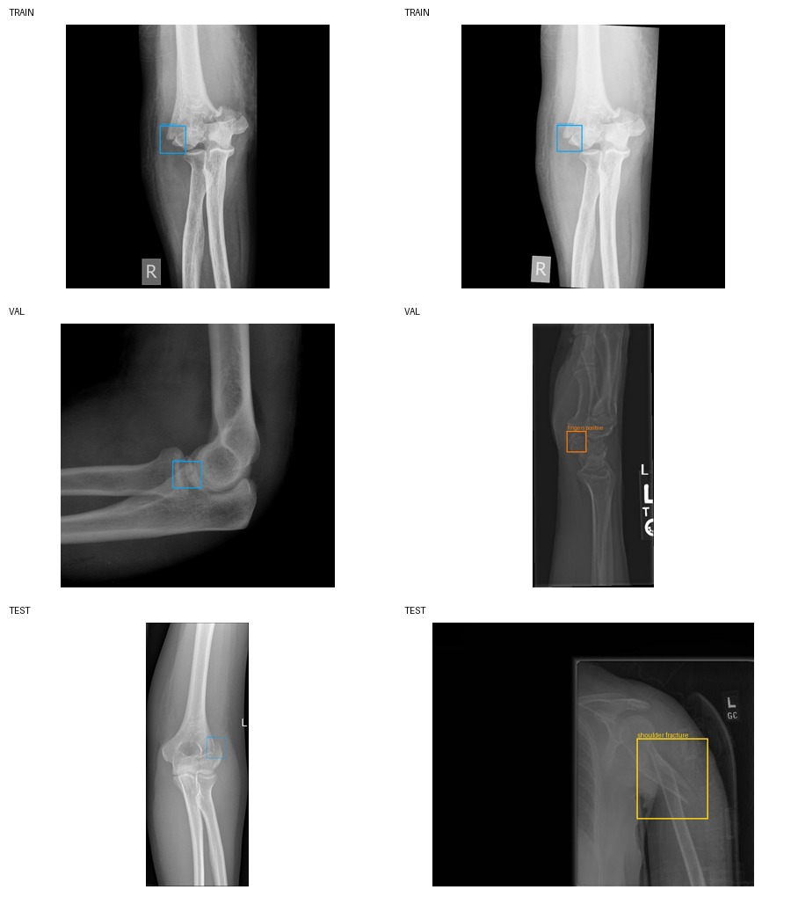
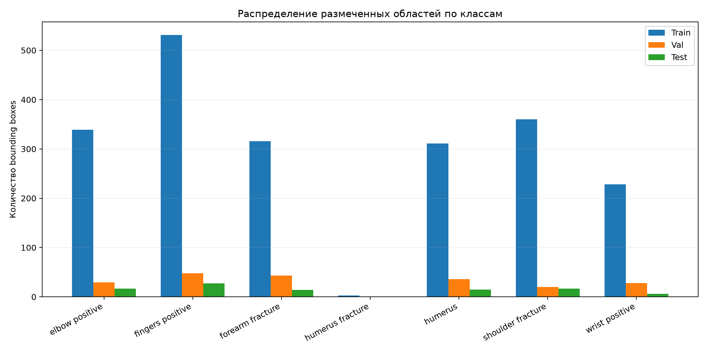

# Bone Fracture Detection Service

Учебный end-to-end проект детекции переломов на рентгеновских снимках:

```text
Streamlit frontend → FastAPI backend → Fast / Accurate YOLO model
```

Пользователь загружает снимок, выбирает одну из двух моделей и порог уверенности,
после чего получает размеченное изображение, список bounding boxes, confidence и время
инференса.

> **Важно:** приложение является учебной демонстрацией. Оно не предназначено для
> медицинской диагностики и не заменяет заключение врача-рентгенолога.

## Соответствие критериям проекта

| Критерий | Реализация |
|---|---|
| Тюнинг модели | Два обоснованных профиля, консервативные X-ray аугментации, автоматическая оценка `mAP@0.5` |
| Backend, 3 балла | FastAPI: `GET /health`, `GET /models`, `POST /predict`, Swagger `/docs`, валидация и HTTP-ошибки |
| Frontend, 2 балла | Streamlit: загрузка снимка, результат, таблица детекций, latency, обработка ошибок |
| Выбор двух моделей, 4 балла | Fast (YOLO11n/640) и Accurate (YOLO11s/768) |
| GitHub, 1 балл | Репозиторий с CI, воспроизводимым обучением, тестами и документацией |
| Видеопрезентация, 2 балла | Готовый сценарий в [`docs/presentation_script.md`](docs/presentation_script.md) |
| Деплой, 4 балла | Docker/Render для API и Streamlit Community Cloud для UI |

Максимальная оценка за модельную часть по выданному ТЗ достигается при
**`mAP@0.5 ≥ 0.5`**. Скрипт оценки ставит поле `target_map50_reached` автоматически;
значения метрик не заполняются вручную.

## Данные

Используется публичный Kaggle-датасет
[Bone Fracture Detection: Computer Vision Project](https://www.kaggle.com/datasets/pkdarabi/bone-fracture-detection-computer-vision-project)
(CC BY 4.0, DOI `10.13140/RG.2.2.14400.34569`). В нём семь классов:

1. Elbow Positive
2. Fingers Positive
3. Forearm Fracture
4. Humerus
5. Humerus Fracture
6. Shoulder Fracture
7. Wrist Positive

Данные не включены в Git из-за размера. Для локальной загрузки:

```bash
python scripts/download_dataset.py
python scripts/prepare_detection_dataset.py \
  --source data/bone-fracture/BoneFractureYolo8 \
  --output data/bone-fracture-detect
python scripts/audit_dataset.py \
  --data data/bone-fracture-detect/data.yaml \
  --output reports/data_audit.json
```

Исходный архив версии 4 содержит сегментационные полигоны. Подготовительный скрипт
преобразует каждый полигон в минимальный axis-aligned bounding box и сохраняет исходные
файлы без изменений. Скрипт аудита проверяет читаемость изображений, YOLO-координаты, ID классов, пустые и
отсутствующие labels, распределение объектов и совпадения изображений между split.





## Обучение в Google Colab

Локальная машина без CUDA нужна только для разработки приложения. Обе модели обучаются
в готовом ноутбуке
[`notebooks/01_colab_train_and_evaluate.ipynb`](notebooks/01_colab_train_and_evaluate.ipynb).

1. Откройте ноутбук в Colab.
2. Выберите `Runtime → Change runtime type → T4 GPU`.
3. Выполняйте ячейки сверху вниз.
4. Разрешите доступ к Google Drive.
5. После завершения возьмите из `MyDrive/bone-fracture-detector/`:
   - `models/fast.pt`;
   - `models/accurate.pt`;
   - `metrics.csv` и `metrics.json`;
   - `data_audit.json`;
   - графики из `runs/`.
6. Положите веса в локальную папку `models/`, а метрики — в `reports/`.

Ноутбук скачивает датасет через официальный Kaggle CLI. Для публичного датасета токен
обычно не требуется. Если Kaggle запросит авторизацию, добавьте в Colab secret
`KAGGLE_API_TOKEN` из настроек Kaggle.

### Профили обучения

| Профиль | Checkpoint | `imgsz` | Эпохи | Batch | Назначение |
|---|---|---:|---:|---:|---|
| Fast | YOLO11n | 640 | 35 | 16 | небольшой вес и низкая CPU latency |
| Accurate | YOLO11s | 768 | 50 | 8 | лучшее распознавание небольших областей |

Для рентгенов отключены hue/saturation, vertical flip, mosaic и mixup. Оставлены только
небольшие повороты, сдвиги, масштабирование, изменение яркости и horizontal flip.

Основная постановка остаётся семиклассовой. Аудит показал, что `humerus fracture`
представлен только 3 объектами в train и отсутствует в validation/test. Если после обучения
обеих моделей реальный `mAP@0.5` ниже 0.5, ноутбук позволяет явно включить
`SINGLE_CLASS = True` и повторить обучение для продуктовой постановки `fracture`. Этот
fallback нельзя включать после просмотра test: решение принимается по validation.

Те же операции доступны из CLI на GPU-машине:

```bash
python scripts/train.py --data /path/to/data.yaml --profile fast --device 0
python scripts/train.py --data /path/to/data.yaml --profile accurate --device 0
python scripts/evaluate.py --data /path/to/data.yaml --split test --device 0
```

## Локальный запуск приложения

Требуется Python 3.10–3.12.

```bash
python -m venv .venv
source .venv/bin/activate
pip install -r requirements-ml.txt
uvicorn backend.main:app --reload
```

Во втором терминале:

```bash
source .venv/bin/activate
streamlit run frontend/app.py
```

Откройте:

- UI: <http://localhost:8501>
- Swagger: <http://localhost:8000/docs>
- healthcheck: <http://localhost:8000/health>

Без `models/fast.pt` и `models/accurate.pt` API запускается, но честно показывает модели
как недоступные и возвращает `503` на запрос инференса.

## API

### `GET /health`

```json
{"status": "ok", "ready": true, "available_models": 2}
```

### `GET /models`

Возвращает модели, описание режима, размер входа и признак доступности весов.

### `POST /predict`

`multipart/form-data`:

- `file`: JPEG, PNG или WEBP до 10 МБ;
- `model_name`: `fast` или `accurate`;
- `confidence`: от `0.05` до `0.95`.

Ответ содержит координаты в пикселях и PNG с отрисованными областями в base64.

## Тесты

API тестируется без PyTorch на детерминированном fake detector; это проверяет весь контракт,
валидацию, выбор модели и формирование изображения, не маскируя отсутствие обученных весов.

```bash
pip install -r requirements-dev.txt
ruff check .
pytest --cov=fracture_detector --cov=backend
```

## Деплой

### Backend на Render

1. Убедитесь, что два fine-tuned `.pt` находятся в `models/`.
2. Подключите GitHub-репозиторий в Render или примените `render.yaml`.
3. Исправьте `CORS_ORIGINS` на реальный адрес Streamlit.
4. Проверьте `/health` и `/docs` после сборки Docker-образа.

### Frontend на Streamlit Community Cloud

1. Создайте приложение из этого GitHub-репозитория.
2. Entry point: `frontend/app.py`.
3. В Secrets добавьте:

```toml
API_URL = "https://YOUR-RENDER-SERVICE.onrender.com"
```

4. Проверьте Fast и Accurate на одном и том же снимке в режиме инкогнито.

Для локальной проверки контейнеров можно использовать `docker compose up --build`.

## Структура

```text
backend/                  FastAPI entrypoint
frontend/                 Streamlit UI
fracture_detector/        inference, model registry, image processing, schemas
scripts/                  download, audit, train, evaluate
notebooks/                self-contained Colab workflow
models/                   final Fast/Accurate weights
reports/                  generated audit and real metrics
docs/                     report and video script
tests/                    API and image validation tests
```

## Ограничения

- датасет не содержит достаточной клинической информации для медицинского применения;
- возможны false positive и false negative;
- качество на снимках из другой клиники может снизиться из-за domain shift;
- `confidence` не является вероятностью диагноза;
- test split используется только один раз для финальной таблицы, а решения по тюнингу
  принимаются по validation split.
